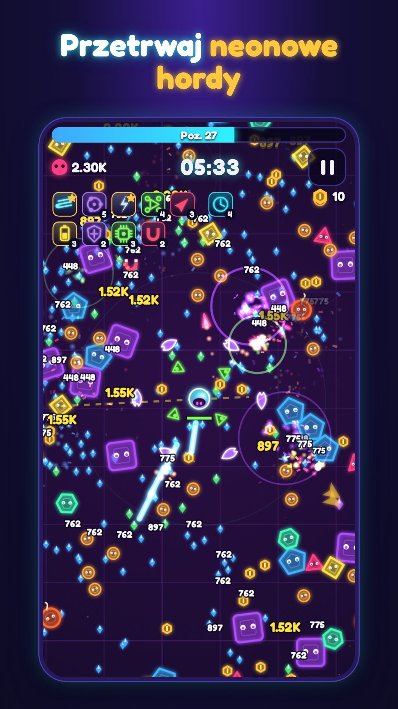
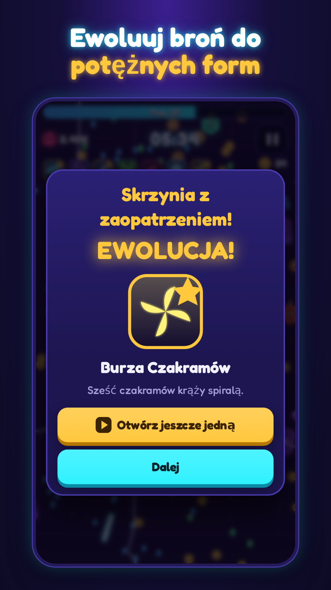
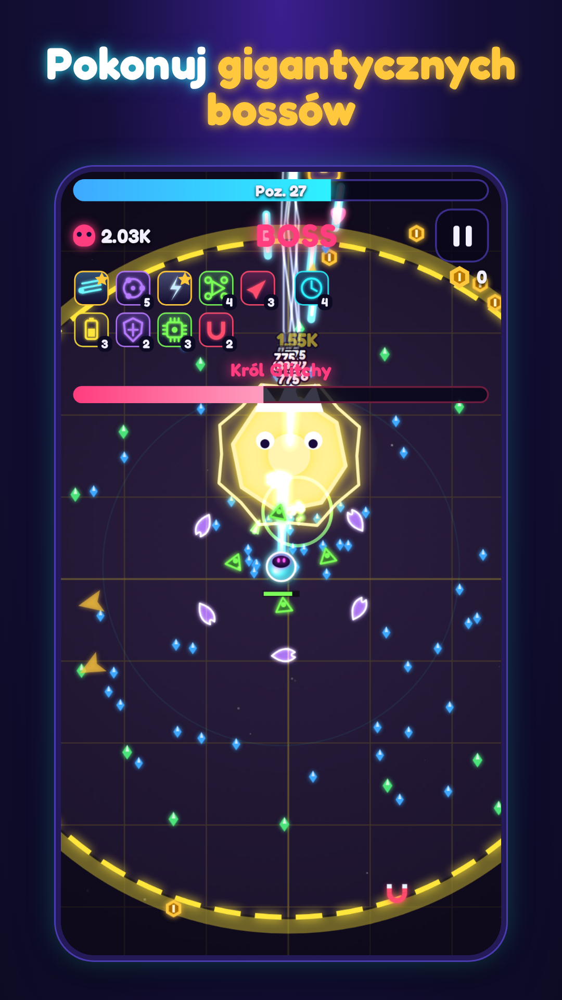
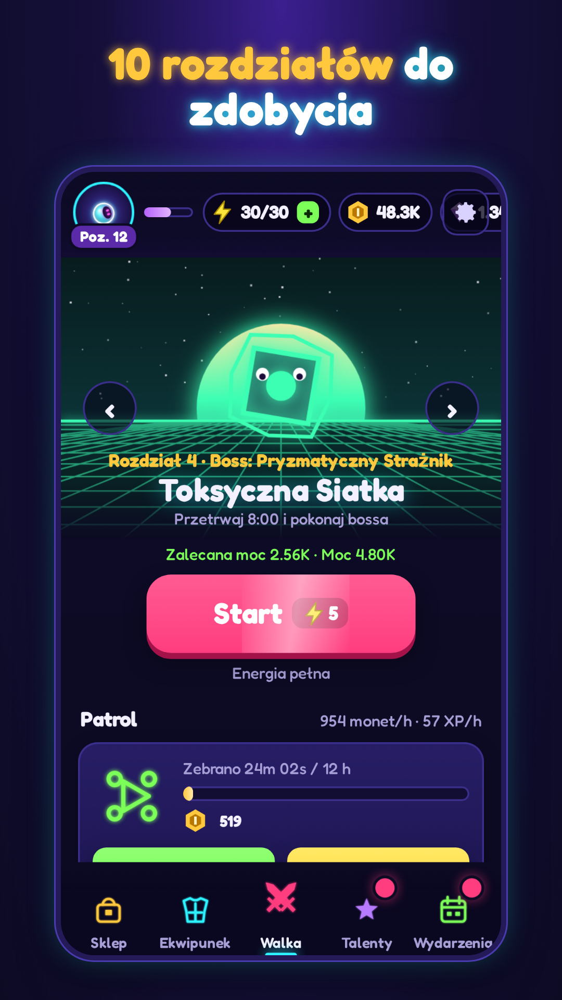

# Neon Horde: Survivor Arena

Mobilna gra typu **survivor roguelite** (hybrid-casual) na Androida: sterujesz jednym palcem, broń
strzela sama, wybierasz ulepszenia, łączysz je w ewolucje i przetrwasz 8 minut do walki z bossem.
Gra jest napisana w **HTML5 Canvas + JavaScript** (bez silnika i bez plików graficznych — wszystko
rysowane kodem) i opakowana w natywną aplikację **Kotlin + WebView** z **Google AdMob** (baner,
reklamy z nagrodą, pełnoekranowe) i zgodą **UMP** (RODO).

| Rozgrywka | Ewolucja | Boss | Lobby |
|---|---|---|---|
|  |  |  |  |

Projekt gry, nisza, pętle rozgrywki i monetyzacja: [`docs/GDD.md`](docs/GDD.md).

## Szybki start

### 1. Zagraj w przeglądarce (najszybszy podgląd)
```bash
npm run serve            # albo: python3 -m http.server 8765 -d game
# otwórz http://localhost:8765 i włącz w DevTools widok telefonu (Ctrl+Shift+M)
```
Sterowanie: przeciągnij palcem/myszą (lub WASD). W przeglądarce reklamy są symulowane planszą
„AD · web preview”; `?noads=1` w adresie ukrywa baner.

### 2. Uruchom na telefonie / emulatorze (Android Studio)
1. Zainstaluj **Android Studio** (najnowsze) i otwórz folder **`android/`** (*File → Open*).
2. Poczekaj na synchronizację Gradle. Jeśli Android Studio zaproponuje aktualizację AGP/Kotlin/bibliotek —
   możesz ją przyjąć (projekt: AGP 8.12, Kotlin 2.2, compileSdk/targetSdk 36, minSdk 26).
3. *Device Manager* → utwórz emulator (np. Pixel 8, Android 15/16) albo podłącz telefon z włączonym
   debugowaniem USB.
4. Wybierz konfigurację **app** i kliknij **Run ▶**. Build debug używa testowych reklam Google.

Gra jest pakowana bezpośrednio z folderu `game/` (ustawione w `android/app/build.gradle.kts`), więc
każda zmiana w grze trafia do APK przy kolejnym buildzie — jedno źródło kodu dla web i Androida.

### 3. Wydanie na Google Play
Krok po kroku: [`docs/RELEASE_CHECKLIST.md`](docs/RELEASE_CHECKLIST.md) · reklamy i zgoda:
[`docs/ADMOB_SETUP.md`](docs/ADMOB_SETUP.md) · teksty i grafiki karty sklepu:
[`docs/PLAY_STORE_LISTING.md`](docs/PLAY_STORE_LISTING.md) + [`docs/store/`](docs/store).
```bash
cd android && ./gradlew bundleRelease   # → app/build/outputs/bundle/release/app-release.aab
```

## Co jest w grze
- **Rozgrywka:** 8 broni (blaster, orbitalne ostrza, łańcuch piorunów, bomby, drony, dysk, mroźna nova,
  rakiety), 8 pasywek, 8 ewolucji, 7 typów wrogów + elity, 5 bossów (+ wersje Mk II), 10 rozdziałów,
  fale specjalne (okrążenie, szarża, deszcz bomb), skrzynie elit, magnes, bomba, apteczki.
- **Game feel:** poświaty, cząsteczki, liczby obrażeń, trzęsienie ekranu, hit-stop, zwolnienie przy
  level-upie, proceduralne SFX i generatywna muzyka synthwave, wibracje.
- **Meta:** ekwipunek w 6 rzadkościach z perkami i łączeniem 3→1, talenty, poziom konta, energia,
  patrol offline (do 12 h), skrzynie (darmowa złota co 8 h), 7-dniowe logowanie, zadania dzienne,
  osiągnięcia, przewodnik ewolucji, EN/PL.
- **Monetyzacja:** 12 miejsc reklam z nagrodą + licznik reklam dnia (3/6/10/15), baner tylko w menu,
  pełnoekranowe tylko w naturalnych przerwach z limitami — szczegóły w GDD.
- **Android:** pełny ekran, splash, ikona adaptacyjna (z wersją monochromatyczną), powiadomienia
  lokalne (skrzynia gotowa, patrol pełny, energia), przycisk wstecz, In-App Review, odtworzenie
  WebView po awarii renderera, zapis gry w `localStorage` z kopią zapasową.

## Struktura
```
game/                 gra HTML5 (index.html, css/, js/, fonts/, privacy.html)
  js/core/            util, config (balans!), i18n, save, audio, platform (most do Androida)
  js/game/            symulacja: world, weapons, enemies, input, juice (efekty)
  js/render/          sprites, fx, renderer
  js/meta/            meta-progresja (ekwipunek, talenty, patrol, skrzynie, zadania…)
  js/ui/              UI: ui, lobby, stage, run-ui ; js/main.js — kontroler i pętla gry
android/              projekt Android Studio (Kotlin): MainActivity, GameBridge, AdsManager, powiadomienia
tools/                simulate.js (balans), store-assets.js (grafiki sklepu), generate-art.sh (Pollinations)
tests/                unit/ (node:test), e2e/smoke.js (Playwright, emulowany telefon)
docs/                 GDD, konfiguracja AdMob, karta sklepu, checklista, zrzuty ekranu
.claude/skills/       skille Claude Code używane w projekcie (spis: .claude/skills/SOURCES.md)
```

## Testy i narzędzia
```bash
npm test                 # 33 testy jednostkowe: rdzeń, zapis, meta-progresja, symulacja
npm run sim              # symulacja balansu: bot przechodzi rozdziały na różnych etapach rozwoju
npm run e2e              # Playwright: samouczek, level-up, boss, wyniki, reklama, lobby (+ zrzuty w docs/screenshots)
npm run store-assets     # ikona 512, grafika 1024×500 i 14 zrzutów 9:16 (EN/PL) do docs/store
```
`npm run e2e` i `store-assets` wymagają Playwrighta (`npm i` albo globalny) i Pythona 3.

Balans zmieniasz w `game/js/core/config.js` (bronie, wrogowie, rozdziały, nagrody, reklamy), a
potem sprawdzasz `npm run sim` — tabela pokazuje, czy dany poziom ekwipunku przechodzi rozdział.

## Co musisz uzupełnić sam
1. Identyfikatory AdMob (`android/gradle.properties`) — build release bez nich się nie zbuduje.
2. Dane dewelopera w `C.DEVELOPER` (`game/js/core/config.js`) i publiczny URL polityki prywatności.
3. Klucz podpisu (`android/keystore.properties`) — instrukcja w checkliście.
4. Konto Google Play Console i AdMob.

Fonty: Fredoka (SIL Open Font License, `game/fonts/OFL.txt`).
